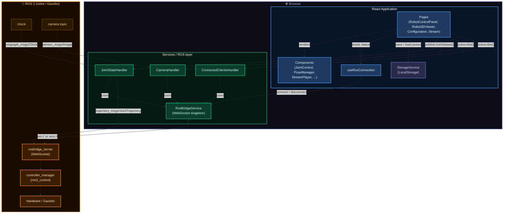
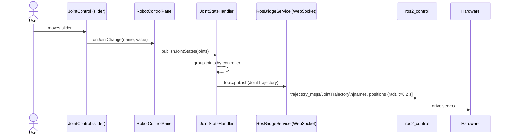

# Architecture Overview

## Module map

```
src/
├── Pages/          Route-level views (React components)
├── Components/     Shared UI components
├── Services/
│   ├── ros/        ROS Bridge communication layer
│   │   ├── ros.service.ts          WebSocket lifecycle singleton
│   │   └── handlers/               Topic-specific publish/subscribe logic
│   ├── storage.service.ts          LocalStorage persistence
│   └── axiosClient.service.ts      HTTP client (REST endpoints)
├── Constants/      Static config (ROS topics, joint mappings, types)
├── hooks/          Custom React hooks
└── Utils/          Pure helpers (math, logger)
```

---

## System diagram



---

## Joint control data flow


